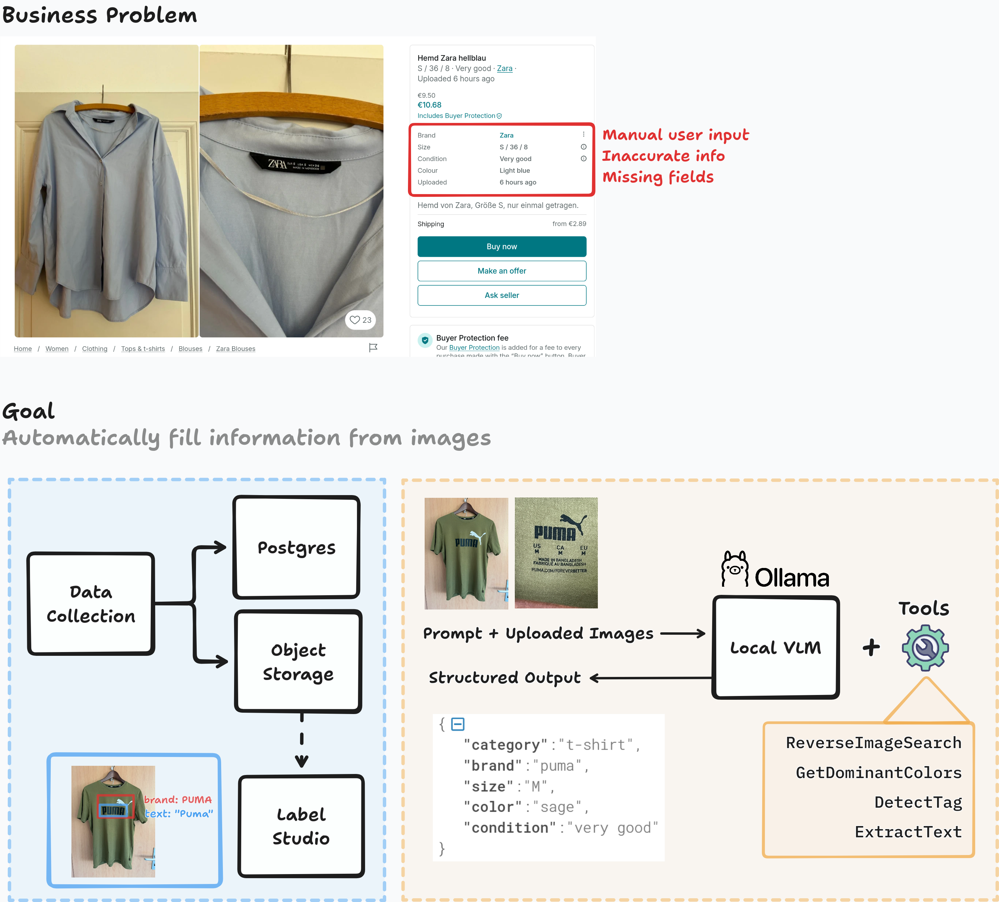

# AutoTagging

    Automatically fill listing metadata for platforms like Vinted with locally-depolyed VLMs. 

## Project Description

**Roadmap**

- ✅ Data scraping engine
- ✅ Postgres for listings + Object storage for image files
- ✅ Scheduled data collection jobs 
- ✅ Pipe new samples to LabelStudio for labeling / verification / quality control 
- ✅ Setup local VLMs with OLLAMA 
- ✅ Setup local VLMs with Smol 
- ✅ Test different strategies for structured output
- ✅ Wrap model in a REST API 
- ⏳ In progress: Add tool calling
